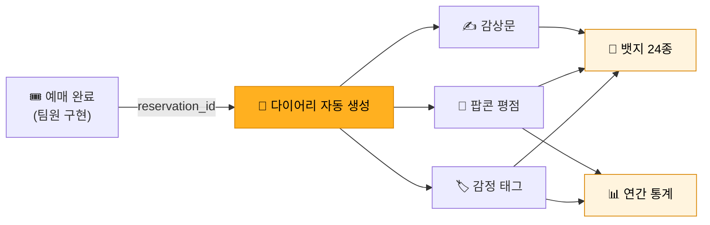
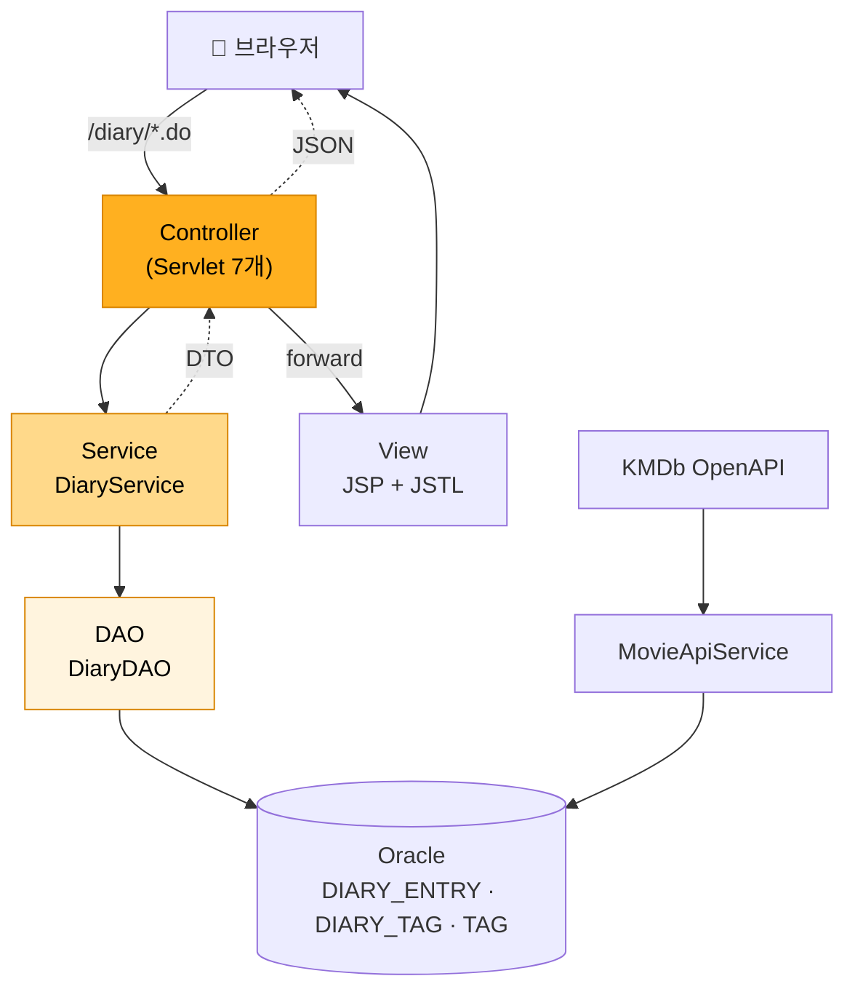

<div align="center">


# POPFLIX

### 티켓을 끊는 순간부터, 그 영화가 **내 기록으로 남기까지** — 한 곳에서

영화 예매 사이트는 보통 표를 파는 데서 끝납니다.<br/>
Popflix는 그 뒤를 이어붙였습니다 — **예매한 영화가 그대로 나만의 기록 노트가 되는 필름 다이어리.**

<br/>


<br/>

**팀 프로젝트 5명** · 2026.05 · 에이콘아카데미<br/>
**조아진 담당 — 필름 다이어리 모듈 · DB 설계 · 최종 발표**

<sub>서비스명은 **POPFLIX**, repo명은 `webProj_Popflex` 입니다.</sub>

</div>

---

## 목차

- [한눈에 보기](#한눈에-보기)
- [내가 맡은 것 — 필름 다이어리](#내가-맡은-것--필름-다이어리)
- [뱃지 24종](#뱃지-24종)
- [주요 기능](#주요-기능)
- [기술 스택](#기술-스택)
- [아키텍처](#아키텍처)
- [DB 설계](#db-설계)
- [트러블슈팅](#트러블슈팅)
- [실행 방법](#실행-방법)
- [폴더 구조](#폴더-구조)
- [회고](#회고)

---

## 한눈에 보기

영화 예매 서비스는 보통 **표를 사는 순간까지**만 다룹니다.
Popflix는 그 다음을 붙였습니다 — **본 뒤에 남는 기록.**

예매가 끝나면 그 예매 건이 자동으로 다이어리에 꽂히고, 사용자는 거기에 감정 태그와 팝콘 평점, 감상문을 남깁니다.
그 기록이 쌓이면 뱃지가 열리고, 연간 통계로 "올해 내가 뭘 봤는지"가 한 장으로 정리됩니다.

> ### 💡 필름 다이어리는 제가 **제안한** 기능입니다
>
> 처음 기획에는 없던 기능입니다. 예매·좌석·리뷰까지만 있는 평범한 영화 사이트였습니다.
>
> 저는 **영화 티켓을 다이어리에 붙여 모으고 그 옆에 관람평을 적는 습관**에서 아이디어를 얻어, 이걸 서비스 안에 넣자고 팀에 제안했습니다.
> 예매 기록은 이미 DB에 있으니, 그 위에 **감정과 기억을 얹으면** 예매 사이트가 *기록 노트*가 될 수 있다고 봤습니다.
>
> 제안이 받아들여져 **기획 · 설계 · 화면 · 코드까지 전부 제가 맡아** 만들었습니다.
> 화면도 실제 **다이어리 노트처럼** 보이도록 디자인했습니다.
>
> 참고할 만한 선례가 거의 없는 기능이라, **베낄 자료 없이 처음부터 스스로 설계해야 했던 것**이 이 프로젝트에서 가장 어렵고, 가장 많이 배운 지점이었습니다.

| | |
| --- | --- |
| **기간 · 인원** | 2026.05 · 팀 프로젝트 5명 (에이콘아카데미) |
| **아키텍처** | Servlet/JSP 기반 MVC2 (Controller–Service–DAO 3계층) |
| **DB** | Oracle 19c · 15개 테이블 |
| **외부 연동** | KMDb 영화 OpenAPI · 네이버 OAuth2 로그인 |

### 팀 안에서 내 역할

5명이 도메인을 나눠 맡았고, 저는 **필름 다이어리 모듈 전체**와 **DB 설계**, 그리고 **최종 발표**를 담당했습니다.

| 담당 | 내용 |
| --- | --- |
| **필름 다이어리 모듈** | 설계부터 구현까지 전부. 다이어리 목록·상세·캘린더·감정 태그·팝콘 평점·연간 통계·**뱃지 24종** <br/>(Java 1,935줄 + JSP 5,454줄) |
| **DB 설계** | 15개 테이블 스키마 설계 · 제약조건 설계 ([DDL](./docs/schema.sql)) |
| **최종 발표** | 프로젝트 최종 발표 |

> 예매·좌석(`reservation`), 회원·소셜로그인(`member`), 영화 API(`movie`), 리뷰(`review`), 관리자(`admin`), 친구(`friend`), 상영관·스케줄(`screen`·`schedule`)은 **팀원이 구현**했습니다.
> 아래 트러블슈팅과 설계 설명은 **제가 직접 구현한 다이어리 파트**에 한정된 내용입니다.

---

## 내가 맡은 것 — 필름 다이어리

예매 → 관람 → **기록** 으로 이어지는 흐름을 담당했습니다.



### 다이어리 서블릿 7개

| 서블릿 | URL | 하는 일 |
| --- | --- | --- |
| `DiaryListServlet` | `/diary/list.do` | 연도 필터 · 정렬(최신·오래된·평점순)로 다이어리 목록 조회 |
| `DiaryDetailServlet` | `/diary/detail.do` | 다이어리 1건 상세 + 태그 목록 (본인 확인 후 노출) |
| `DiaryTagUpdateServlet` | `/diary/tagUpdate.do` | 감정 태그 다중 선택 + 팝콘 평점 + 감상문 저장 |
| `DiaryCalendarServlet` | `/diary/calendar.do` | 월별 다이어리를 JSON으로 응답 (AJAX 캘린더) |
| `DiaryStatServlet` | `/diary/stat.do` | 연간 통계 — 관람 수 · 평균 평점 · 최다 방문 극장 · 월별 · 태그 빈도 |
| `DiaryBadgeServlet` | `/diary/badge.do` | 뱃지 24종 달성 현황 + 진행도 |
| `DiaryDeleteServlet` | `/diary/delete.do` | 기록 초기화 (리뷰-다이어리 연결 해제) |

---

## 뱃지 24종

관람 이력을 조건별로 집계해 **24종의 뱃지**를 부여합니다.
저장 테이블 없이 **조회 시점에 동적으로 집계**합니다 → [왜 그렇게 했는지](#2-뱃지를-테이블에-저장했더니-정합성이-계속-깨졌다)

<details>
<summary><b>뱃지 24종 전체 보기</b> — 조건별 아이콘</summary>
<br/>

<div align="center">

| | | | | | |
|:--:|:--:|:--:|:--:|:--:|:--:|
| <br/>**첫 필름**<br/><sub>기록 1개</sub> | <br/>**기록 수집가**<br/><sub>기록 10개</sub> | <br/>**단골 관람객**<br/><sub>기록 20개</sub> | <br/>**시네마 마니아**<br/><sub>기록 50개</sub> | <br/>**올해의 관객**<br/><sub>올해 50편</sub> | <br/>**연속 관람**<br/><sub>3주 연속</sub> |
| <br/>**인생작 발견**<br/><sub>팝콘 5.0 · 1개</sub> | <br/>**골든 팝콘**<br/><sub>팝콘 5.0 · 5개</sub> | <br/>**신선한 눈**<br/><sub>팝콘 4.5+ · 10개</sub> | <br/>**탄 팝콘**<br/><sub>팝콘 2.0- · 3개</sub> | <br/>**혹평가**<br/><sub>팝콘 1.0 · 5회</sub> | <br/>**팝콘 부자**<br/><sub>팝콘 총합 50점</sub> |
| <br/>**팝콘 러버**<br/><sub>태그 5편</sub> | <br/>**감정 수집가**<br/><sub>태그 5종</sub> | <br/>**감정의 소용돌이**<br/><sub>한 편에 5종</sub> | <br/>**꼼꼼한 기록러**<br/><sub>감상문 300자</sub> | <br/>**부엉이족**<br/><sub>심야 5편</sub> | <br/>**감독 팬**<br/><sub>같은 감독 5편</sub> |
| <br/>**장르 마스터**<br/><sub>같은 장르 20편</sub> | <br/>**로맨티스트**<br/><sub>로맨스 5편</sub> | <br/>**강심장**<br/><sub>공포 5편</sub> | <br/>**우주 정복자**<br/><sub>SF 10편</sub> | <br/>**셜록홈즈**<br/><sub>범죄·추리 5편</sub> | <br/>**동심 수호자**<br/><sub>애니 5편</sub> |

</div>

</details>

<sub>뱃지 정의: [`DiaryService.getBadgeList()`](./src/main/java/diary/service/DiaryService.java#L136-L217)</sub>

---

## 주요 기능

| | 기능 | 설명 |
| :--: | --- | --- |
| 🎬 | **영화 조회·검색** | KMDb OpenAPI로 영화 정보·출연진·키워드 조회 |
| 🎟️ | **예매** | 상영 스케줄 → 좌석 선택 → 예매 · 취소 · 내역 조회 |
| 📔 | **필름 다이어리** | 예매한 영화가 자동으로 기록되고, 감정 태그·팝콘 평점·감상문을 남김 |
| 🏅 | **뱃지 24종** | 관람 이력을 조건별로 집계해 부여 (조회 시점 동적 집계) |
| 📊 | **연간 통계** | 월별 관람 수 · 평균 평점 · 최다 방문 극장 · 감정 태그 빈도 |
| ⭐ | **리뷰** | 리뷰 작성·수정·삭제, 영화별 평점 통계 |
| 👥 | **친구** | 친구 검색·추가·삭제 |
| 🔐 | **로그인** | 자체 회원가입(SHA-256) + 네이버 OAuth2 소셜 로그인 |
| 🛠️ | **관리자** | 회원 권한 관리 · 상영 스케줄 등록 · 좌석 관리 · 에러 로그 |

---

## 기술 스택

| 구분 | 사용 | 선택 이유 |
| --- | --- | --- |
| **언어** | Java 17 | 학습 중인 주 언어. `record`·`var` 같은 최신 문법 대신 기본기에 집중 |
| **웹** | Servlet 4.0 / JSP / JSTL 1.2 | 프레임워크에 기대기 전에 **요청–응답과 MVC가 실제로 어떻게 도는지** 직접 만들어보려고 MVC2를 손으로 구현 |
| **DB** | Oracle 19c (ojdbc8) | 수업에서 다룬 DB. `TO_CHAR(…, 'IW')` 같은 **ISO 주차 함수**를 쓸 수 있어 연속 관람 판정에 유리했음 |
| **DB 접근** | JDBC (순수) | ORM 없이 SQL을 직접 써서 **쿼리와 트랜잭션이 어디서 도는지** 눈으로 확인하려고 |
| **빌드** | Maven (war) | 의존성 관리 + `cargo` 플러그인으로 Tomcat 9 로컬 구동 |
| **JSON** | Gson 2.11 / org.json | 캘린더 AJAX 응답과 KMDb API 응답 파싱 |
| **외부 API** | KMDb OpenAPI · 네이버 OAuth2 | 영화 데이터 / 소셜 로그인 |

---

## 아키텍처

**MVC2 패턴**을 프레임워크 없이 직접 구성했습니다. 요청은 서블릿(Controller)이 받고, 비즈니스 로직은 Service, DB 접근은 DAO가 맡습니다.



**왜 3계층으로 나눴나** — 뱃지 하나를 계산하는 데 카운트 쿼리가 15개 넘게 필요했습니다.
이걸 서블릿에 다 넣으면 서블릿이 수백 줄이 되고, 나중에 뱃지를 추가할 때마다 서블릿을 열어야 합니다.
DAO에 "세는 일"만 모아두고 Service가 "판정"만 하도록 나누니, **뱃지 추가가 `badges.add(...)` 한 줄**로 끝납니다.

---

## DB 설계

15개 테이블을 설계했습니다. 전체 DDL은 [`docs/schema.sql`](./docs/schema.sql)에 있습니다.

<details>
<summary><b>ERD 보기</b> (다이어리 중심)</summary>

```mermaid
erDiagram
    MEMBER ||--o{ DIARY_ENTRY : "기록한다"
    MEMBER ||--o{ RESERVATION : "예매한다"
    MOVIE  ||--o{ DIARY_ENTRY : "기록된다"
    RESERVATION ||--o| DIARY_ENTRY : "1:1 (UNIQUE)"
    REVIEW ||--o| DIARY_ENTRY : "연결된다"
    DIARY_ENTRY ||--o{ DIARY_TAG : "가진다"
    TAG ||--o{ DIARY_TAG : "쓰인다"

    MEMBER {
        NUMBER MEMBER_ID PK
        VARCHAR2 USER_ID UK
        VARCHAR2 EMAIL UK
        CHAR ROLE "U/A"
    }
    DIARY_ENTRY {
        NUMBER DIARY_ID PK
        NUMBER MEMBER_ID FK
        NUMBER MOVIE_ID FK
        NUMBER RESERVATION_ID FK-UK "★ UNIQUE"
        NUMBER REVIEW_ID FK
        DATE WATCH_DATE
        NUMBER POPCORN_RATING "1.0~5.0"
    }
    RESERVATION {
        NUMBER RESERVATION_ID PK
        NUMBER MEMBER_ID FK
        NUMBER SCHEDULE_ID FK
        CHAR STATUS "Y/C"
    }
    DIARY_TAG {
        NUMBER DIARY_TAG_ID PK
        NUMBER DIARY_ID FK
        NUMBER TAG_ID FK
    }
    TAG {
        NUMBER TAG_ID PK
        VARCHAR2 TAG_NAME
    }
```

전체 테이블: `MEMBER` `MOVIE` `MOVIE_ACTOR` `MOVIE_KEYWORD` `THEATER` `SCREEN` `SEAT` `SCHEDULE` `RESERVATION` `RESERVATION_SEAT` `REVIEW` `DIARY_ENTRY` `DIARY_TAG` `TAG` `FRIEND`

</details>

---

## 트러블슈팅

### 1. 내 기능 하나가 팀 전체 도메인과 맞물려 있었다

**문제** — 필름 다이어리는 **독립적인 기능이 아니었습니다.** 예매가 끝나야 다이어리가 생기고, 영화의 장르·감독을 알아야 뱃지를 판정하고, 리뷰를 쓰면 다이어리에 연결됩니다. 즉 **팀원 4명이 각자 만드는 도메인 전부에 제 기능이 의존**했습니다 — `DIARY_ENTRY`가 FK를 4개 갖고 있는 게 그 증거입니다.

```
DIARY_ENTRY
 ├── MEMBER_ID      → 회원 (팀원)
 ├── MOVIE_ID       → 영화 · KMDb API (팀원)
 ├── RESERVATION_ID → 예매 (팀원)
 └── REVIEW_ID      → 리뷰 (팀원)
```

문제는 **다들 동시에 만드는 중**이었다는 것입니다. 팀원이 예매 로직을 고치면 제 다이어리가 깨지고, 남의 코드가 끝나길 기다리면 제 파트는 시작조차 못 했습니다.

**선택 — 접점을 "ID 하나"로 줄였다**

남의 도메인 내부를 들여다보지 않고, **오직 ID로만 연결**하기로 했습니다.

| 접점 | 방식 |
| --- | --- |
| 예매 → 다이어리 | `RESERVATION_ID` **하나만** 받는다 (FK + UNIQUE) |
| 리뷰 → 다이어리 | `REVIEW_ID` 하나만 연결하고, 없으면 `NULL` |
| 영화 정보 | 직접 조회하지 않고 **`MOVIE_ID`로 JOIN**해 필요한 순간에만 읽는다 |

DB 설계를 제가 맡고 있었기에 이 접점을 스키마 레벨에서 먼저 못 박았고, `ON DELETE SET NULL`로 **리뷰·예매가 지워져도 다이어리는 살아남게** 했습니다.

**결과** — 팀원 파트가 미완성이어도 ID만 있으면 다이어리를 먼저 만들고 테스트할 수 있었습니다.

**배운 것** — 여러 사람이 동시에 만드는 프로젝트에서는 **"무엇을 아느냐"보다 "무엇을 모르는 채로 둘 수 있느냐"** 가 중요하다는 걸 배웠습니다.

---

### 2. 뱃지를 테이블에 저장했더니, 정합성이 계속 깨졌다

**문제** — 처음엔 당연하다고 생각하고 `MEMBER_BADGE` 테이블을 만들어 달성한 뱃지를 INSERT 했습니다.
그런데 사용자가 **팝콘 평점을 수정하거나 다이어리를 지우면** 뱃지 조건이 다시 거짓이 됩니다.
그때마다 뱃지 테이블도 같이 갱신해야 하는데, **평점 수정·다이어리 삭제·태그 변경** 등 뱃지에 영향을 주는 경로가 계속 늘어났습니다.
경로 하나를 빠뜨리면 **"조건을 만족하지 않는데 뱃지를 갖고 있는"** 상태가 됩니다.

**고려한 선택지**

| 선택지 | 문제 |
| --- | --- |
| ① 뱃지에 영향 주는 모든 지점에서 뱃지 테이블 갱신 | 갱신 지점이 계속 늘어남. 하나만 빠뜨려도 데이터가 어긋남 |
| ② 트리거로 자동 갱신 | 뱃지 조건이 24개라 트리거가 감당이 안 되고, 로직이 DB에 숨어버림 |
| ③ **저장하지 않고, 조회할 때마다 다시 센다** | 매번 카운트 쿼리를 돌려야 함 (성능) |

**선택** — ③을 택했습니다.
뱃지는 **"현재 기록 상태에서 유도되는 값"** 이지 독립적으로 존재하는 데이터가 아닙니다.
그러면 애초에 저장하지 않는 게 맞습니다 — **저장하지 않으면 어긋날 수가 없습니다.**

성능은 뱃지 화면(`/diary/badge.do`)에서만 계산하도록 범위를 좁혀 감수했습니다.
개인 관람 기록은 많아야 수백 건이라 카운트 쿼리가 부담되는 규모가 아니라고 판단했습니다.

**결과**

- 정합성 문제가 **구조적으로 사라졌습니다** (틀릴 수 있는 상태 자체가 없어짐)
- 뱃지 추가 비용이 **`badges.add(...)` 한 줄**로 떨어졌습니다 — 실제로 12종에서 **24종으로 늘릴 때** 다른 코드를 건드리지 않았습니다

```java
// DiaryService.getBadgeList() — 저장하지 않고, 셀 것만 세서 그 자리에서 판정
int totalCount = diaryDAO.countAllDiary(memberId);
badges.add(new BadgeDTO("FIRST_FILM", "첫필름.png", "첫 필름",
        "영화 다이어리 기록 1개 이상", totalCount >= 1, date1st, Math.min(totalCount, 1), 1));
```

**배운 것** — **"저장할 값"과 "유도되는 값"을 구분하는 것**이 설계의 첫 단추라는 걸 알았습니다.
유도되는 값을 저장하는 순간 동기화 책임이 생기고, 그 책임은 코드가 늘어날수록 반드시 새어나갑니다.

---

### 3. 새로고침 한 번에 관람 기록이 두 개 생겼다

**문제** — 예매를 완료하면 다이어리가 자동 생성되는데, 사용자가 **완료 페이지에서 새로고침**하면 같은 예매로 다이어리가 하나 더 생겼습니다.

**고려한 선택지**

| 선택지 | 문제 |
| --- | --- |
| ① INSERT 전에 SELECT로 존재 여부 확인 | **경합에 취약** — 두 요청이 동시에 SELECT하면 둘 다 "없음"을 보고 둘 다 INSERT |
| ② PRG 패턴(Post/Redirect/Get)으로 재전송 차단 | 새로고침은 막지만 **브라우저 뒤로가기·직접 요청은 못 막음.** 애플리케이션 레벨 방어라 우회 가능 |
| ③ **DB에 UNIQUE 제약을 건다** | 중복이 애초에 **저장될 수 없음** |

**선택** — ③입니다. "한 예매는 다이어리 하나"는 **애플리케이션의 편의가 아니라 데이터 자체의 규칙**입니다.
그렇다면 그 규칙은 데이터를 지키는 쪽(DB)에 있어야 하고, 어떤 경로로 들어오든 뚫리지 않아야 합니다.

```sql
-- DIARY_ENTRY 테이블
CONSTRAINT UQ_DIARY_RESERVATION UNIQUE (RESERVATION_ID)
```

**결과** — 새로고침·뒤로가기·중복 요청 어느 쪽으로도 중복 기록이 생기지 않습니다.
애플리케이션 코드에 중복 체크 로직을 넣지 않고도 **경로 전부가 한 번에 막혔습니다.**

**배운 것** — 애플리케이션 레벨 방어는 **"내가 아는 경로"만** 막습니다.
데이터의 규칙은 DB 제약으로 표현하는 게 가장 확실하다는 걸 배웠습니다.

---

### 4. '연속 관람' 뱃지가 연말·연초 기록을 놓쳤다

**문제** — "3주 연속 관람" 뱃지를 만들면서 처음엔 `TO_CHAR(watch_date, 'YYYY-WW')`로 주차를 뽑았습니다.
그런데 **12월 마지막 주에 보고 1월 첫 주에 본 사람**이 연속으로 인정되지 않았습니다.

원인은 Oracle의 `WW` 포맷이었습니다. `WW`는 **1월 1일부터 7일씩 끊는** 방식이라 연도가 바뀌면 주차가 1로 리셋되고, 해가 걸친 주가 쪼개집니다.

**선택** — **ISO 8601 주차**(`IYYY` / `IW`)로 바꿨습니다.
ISO 주차는 월요일 시작이고 **연말·연초에 걸친 주를 하나의 주로 취급**합니다 — 사람이 "연속으로 봤다"고 느끼는 것과 정확히 일치합니다.

```sql
-- DiaryDAO.getAllWatchWeeks() — WW(X) → IW(O)
SELECT DISTINCT TO_CHAR(watch_date, 'IYYY-IW') AS watch_week
FROM DIARY_ENTRY WHERE member_id = ? ORDER BY watch_week
```

```java
// DiaryService.calcMaxStreak() — 연도가 바뀌는 경계까지 연속으로 처리
boolean consecutive = (currY == prevY && currW == prevW + 1)
        || (currY == prevY + 1 && prevW >= 52 && currW == 1);
```

**결과** — 12월 52주차 → 1월 1주차가 연속으로 이어집니다.

**배운 것** — 날짜는 **"당연히 이럴 것"이라고 넘겨짚으면 반드시 경계에서 터진다**는 걸 알았습니다.
`WW`와 `IW`는 한 글자 차이지만 정의가 완전히 다릅니다. 날짜 함수는 **문서에서 정의를 확인하고 쓰는 습관**이 생겼습니다.

---

## 실행 방법

### 1. 요구 사항

- JDK 17
- Maven 3.9+
- Oracle 19c (또는 XE)

### 2. DB 준비

```bash
# 15개 테이블 생성
sqlplus 계정/비밀번호@localhost:1521/XE @docs/schema.sql
```

### 3. 설정 파일 작성

`src/main/resources/config.example.properties`를 복사해 `config.properties`를 만들고 값을 채웁니다.

```bash
cp src/main/resources/config.example.properties src/main/resources/config.properties
```

```properties
DB_DRIVER=oracle.jdbc.OracleDriver
DB_URL=jdbc:oracle:thin:@localhost:1521:TESTDB
DB_USER=your-db-user
DB_PASSWORD=your-db-password

KMDB_SERVICE_KEY=your-kmdb-service-key   # https://www.kmdb.or.kr 에서 발급 (무료)
KMDB_API_URL=https://api.koreafilm.or.kr/openapi-data2/wisenut/search_api/search_json2.jsp

NAVER_CLIENT_ID=your-naver-client-id
NAVER_CLIENT_SECRET=your-naver-client-secret
NAVER_CALLBACK_URL=http://localhost:8080/MoviePrj/member/naverCallback.do
```

> `config.properties`는 `.gitignore`에 등록돼 있어 저장소에 올라가지 않습니다.
> 코드에서는 [`AppConfig`](./src/main/java/common/config/AppConfig.java)가 이 파일을 읽어 **DB 비밀번호·API 키를 소스에서 완전히 분리**합니다.

### 4. 실행

```bash
mvn clean package
mvn cargo:run          # Tomcat 9가 자동으로 받아져 실행됩니다
```

→ http://localhost:8080/MoviePrj

---

## 폴더 구조

```
webProj_Popflex/
├── docs/
│   ├── schema.sql              # 15개 테이블 DDL
│   └── images/                 # README용 이미지 (뱃지 아이콘 24종)
├── src/main/
│   ├── java/
│   │   ├── diary/              # ★ 필름 다이어리 (조아진 담당)
│   │   │   ├── controller/     #   서블릿 7개
│   │   │   ├── service/        #   DiaryService — 뱃지 판정 · 통계
│   │   │   ├── dao/            #   DiaryDAO — 카운트 쿼리 · CRUD
│   │   │   └── dto/            #   DiaryDTO · BadgeDTO · DiaryStatDTO
│   │   ├── common/             # DBUtil · AppConfig · 암호화 유틸
│   │   ├── member/             # 회원 · 네이버 OAuth2
│   │   ├── movie/              # 영화 조회 · KMDb API
│   │   ├── reservation/        # 예매 · 좌석
│   │   ├── review/             # 리뷰
│   │   ├── schedule/ screen/   # 상영 스케줄 · 상영관
│   │   ├── friend/             # 친구
│   │   └── admin/              # 관리자
│   ├── resources/
│   │   └── config.example.properties
│   └── webapp/
│       ├── WEB-INF/views/      # JSP 30개
│       ├── css/ js/ img/
└── pom.xml
```

---

## 회고

**잘한 것**

**없던 기능을 제안해서 끝까지 만들어낸 것.**
시키는 걸 구현한 게 아니라, "영화 티켓을 다이어리에 모으는 습관"이라는 개인적인 경험에서 기능을 떠올리고, 팀을 설득하고, 기획부터 화면·코드까지 전부 만들었습니다.
참고할 선례가 없어서 **매 결정을 스스로 내려야 했고**, 그래서 이 프로젝트에서 내린 모든 설계 판단을 지금도 이유까지 설명할 수 있습니다.

**뱃지를 "저장하지 않는다"는 결정.**
처음엔 저장하는 게 당연해 보였는데, 정합성이 깨지는 걸 겪고 나서야 **"이건 유도되는 값이구나"** 를 알았습니다.
그 덕분에 뱃지를 12종에서 24종으로 두 배 늘릴 때 다른 코드를 하나도 안 건드렸습니다.

**아쉬운 것**

- **예외 처리가 `printStackTrace()` 뿐입니다.** 로깅 프레임워크를 몰라서 그랬는데, 지금 보면 운영에서 아무것도 추적할 수 없는 코드입니다. 다시 만든다면 SLF4J를 넣겠습니다.
- **뱃지 판정에 카운트 쿼리가 15번 넘게 나갑니다.** 기록이 수백 건 수준이라 문제되지 않았지만, 한 번의 쿼리로 집계하도록 묶을 수 있었습니다. "동적 집계"라는 방향은 맞았지만 **구현이 소박했습니다.**
- **테스트 코드가 없습니다.** ISO 주차 연속 판정처럼 경계 조건이 있는 로직은 단위 테스트로 검증했어야 합니다.

**다시 한다면**

Spring을 쓰지 않고 MVC2를 직접 만든 건 후회하지 않습니다 — DispatcherServlet이 뭘 대신 해주는지 몸으로 알게 됐습니다.
다만 그 다음 단계로 **같은 프로젝트를 Spring Boot + JPA로 다시 만들어보고 싶습니다.** 직접 만든 3계층이 프레임워크에서 어떻게 대응되는지 비교해보고 싶습니다.

---

<div align="center">
<sub>

**조아진** · [GitHub](https://github.com/lastsummer0830) · lastsummer0830@gmail.com

</sub>
</div>
