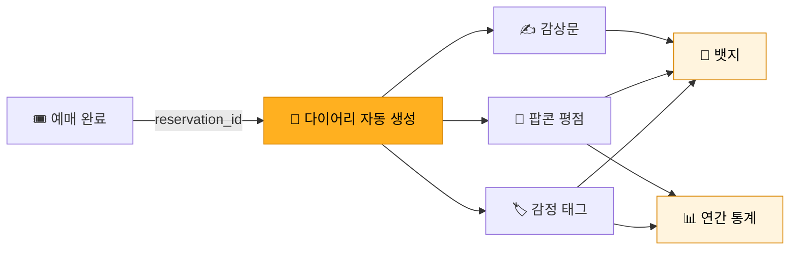
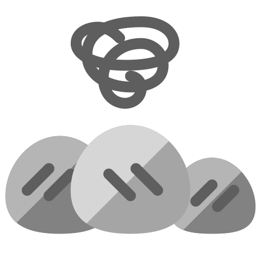
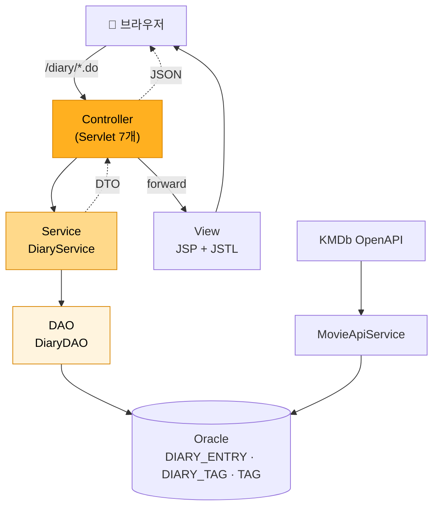

<br/>

<h3 align="center">예매한 영화가 그대로 관람 기록으로 남는 영화 예매 서비스</h3>

<br/>

> 예매 완료 → 다이어리 자동 생성 → 감정 태그 · 팝콘 평점 · 감상문 입력 → 뱃지 · 연간 통계로 환원.<br/>
> **프레임워크 없이 Servlet/JSP MVC2를 직접 구성.** Oracle 15개 테이블 · 다이어리 서블릿 7개 · 로컬 Tomcat 구동(배포 없음).

<br/>

## 프로젝트 개요

**왜 만들었나** — 영화 예매 서비스 대부분이 표를 파는 시점에서 종료되는 구조.
티켓을 다이어리에 붙여 모으고 그 옆에 관람평을 적는 습관에서 착안해, 이미 DB에 있는 예매 기록 위에 감정·평점·감상문을 얹어 기록 노트로 확장.

**왜 프레임워크 없이 MVC2인가** — Spring이 대신 처리하는 요청 분배·포워딩을 직접 만들어보기 위해.
DispatcherServlet 없이 서블릿이 요청을 받아 JSP로 넘기는 경로를 손으로 구성.

| | |
| --- | --- |
| **기간 · 인원** | 2026.05 · 5인 팀 (에이콘아카데미) |
| **아키텍처** | Servlet/JSP MVC2 — Controller · Service · DAO 3계층 |
| **DB** | Oracle 19c · 15개 테이블 |
| **외부 연동** | KMDb 영화 OpenAPI · 네이버 OAuth2 로그인 |
| **저장소 · 서비스명** | repo `webProj_Popflex` / 서비스명 POPFLIX |

**담당 범위** — 필름 다이어리 모듈(설계·구현) · DB 설계 · 최종 발표.
해당 범위 규모는 Java 1,935줄 + JSP 5,454줄. 아래 설명은 이 범위를 다룸.

<br/>

## 주요 기능

| | 기능 | 무엇으로 어떻게 구현했나 |
| :--: | --- | --- |
| 📔 | **다이어리 자동 생성** | 예매 완료 시 `RESERVATION_ID` 하나만 넘겨받아 `DIARY_ENTRY` 1행 생성. 같은 예매로 두 번 생기는 것은 `UQ_DIARY_RESERVATION` UNIQUE 제약으로 차단 |
| 🏷️ | **감정 태그 · 팝콘 평점** | `DiaryTagUpdateServlet`에서 다중 선택 태그를 `DIARY_TAG` 교차 테이블에 재작성. 평점은 0.5 단위 1.0~5.0 |
| 📅 | **캘린더** | `DiaryCalendarServlet`이 월별 조회 결과를 Gson으로 직렬화해 JSON 응답. 화면은 AJAX로만 갱신 |
| 📊 | **연간 통계** | 관람 수 · 평균 평점 · 최다 방문 극장 · 월별 분포 · 태그 빈도를 `DiaryStatDTO` 한 건으로 집계 |
| 🏅 | **뱃지** | 저장 테이블 없이 **조회 시점에 카운트 쿼리로 판정.** 조건은 `DiaryService.getBadgeList()` 한 곳에 정의 |
| 🗂️ | **목록 · 상세** | 연도 필터와 정렬(최신 · 오래된 · 평점순)을 SQL에서 분기. 상세는 세션 회원 ID와 대조 후 노출 |
| 🧹 | **기록 초기화** | 리뷰 연결을 끊고 다이어리 삭제. `ON DELETE SET NULL`이라 리뷰·예매 원본은 잔존 |

**서비스 전체 기능** — 영화 조회·검색(KMDb) · 예매·좌석 · 리뷰 · 친구 · 관리자(권한·스케줄·좌석·에러 로그) · 회원가입(SHA-256)과 네이버 소셜 로그인.

<br/>

### 핵심 — 기록 한 건이 만들어지는 경로


```mermaid
flowchart LR
    R["🎟️ 예매 완료"] -->|reservation_id| D["📔 다이어리 자동 생성"]
    D --> T["🏷️ 감정 태그"]
    D --> P["🍿 팝콘 평점"]
    D --> W["✍️ 감상문"]
    T --> B["🏅 뱃지"]
    P --> B
    W --> B
    T --> S["📊 연간 통계"]
    P --> S
    style D fill:#FFB020,stroke:#d98500,color:#000
    style B fill:#FFF4DE,stroke:#d98500,color:#000
    style S fill:#FFF4DE,stroke:#d98500,color:#000
```

다이어리는 사용자가 새로 쓰는 글이 아니라 **예매 기록에서 파생되는 행.**
따라서 생성 시점은 예매 완료, 입력 대상은 감정 태그·평점·감상문 세 가지로 한정.
뱃지와 연간 통계는 그 입력을 다시 세어 만든 결과라 별도 저장 없이 조회 시점에 산출.

> 📄 [`DiaryService.getBadgeList()`](https://github.com/lastsummer0830/webProj_Popflex/blob/main/src/main/java/diary/service/DiaryService.java#L136-L217) — 뱃지 조건 정의부

<details>
<summary><b>뱃지 조건 전체 보기</b> — 관람 이력을 조건별로 집계해 부여</summary>
<br/>

<div align="center">

| | | | | | |
|:--:|:--:|:--:|:--:|:--:|:--:|
| <br/>**첫 필름**<br/><sub>기록 1개</sub> | <br/>**기록 수집가**<br/><sub>기록 10개</sub> | <br/>**단골 관람객**<br/><sub>기록 20개</sub> | <br/>**시네마 마니아**<br/><sub>기록 50개</sub> | <br/>**올해의 관객**<br/><sub>올해 50편</sub> | <br/>**연속 관람**<br/><sub>3주 연속</sub> |
| <br/>**인생작 발견**<br/><sub>팝콘 5.0 · 1개</sub> | <br/>**골든 팝콘**<br/><sub>팝콘 5.0 · 5개</sub> | <br/>**신선한 눈**<br/><sub>팝콘 4.5+ · 10개</sub> | <br/>**탄 팝콘**<br/><sub>팝콘 2.0- · 3개</sub> | <br/>**혹평가**<br/><sub>팝콘 1.0 · 5회</sub> | <br/>**팝콘 부자**<br/><sub>팝콘 총합 50점</sub> |
| <br/>**팝콘 러버**<br/><sub>태그 5편</sub> | <br/>**감정 수집가**<br/><sub>태그 5종</sub> | <br/>**감정의 소용돌이**<br/><sub>한 편에 5종</sub> | <br/>**꼼꼼한 기록러**<br/><sub>감상문 300자</sub> | <br/>**부엉이족**<br/><sub>심야 5편</sub> | <br/>**감독 팬**<br/><sub>같은 감독 5편</sub> |
| <br/>**장르 마스터**<br/><sub>같은 장르 20편</sub> | <br/>**로맨티스트**<br/><sub>로맨스 5편</sub> | <br/>**강심장**<br/><sub>공포 5편</sub> | <br/>**우주 정복자**<br/><sub>SF 10편</sub> | <br/>**셜록홈즈**<br/><sub>범죄·추리 5편</sub> | <br/>**동심 수호자**<br/><sub>애니 5편</sub> |

</div>

</details>

<br/>

## 기술 스택

| 구분 | 사용 | 선택 이유 |
| --- | --- | --- |
| **언어** | Java 17 | 학습 중인 주 언어. `record`·`var` 같은 최신 문법 대신 기본기에 집중 |
| **웹** | Servlet 4.0 / JSP / JSTL 1.2 | 프레임워크에 기대기 전에 요청–응답과 MVC의 실제 동작을 확인하려고 MVC2를 직접 구성 |
| **DB** | Oracle 19c (ojdbc8) | 수업에서 다룬 DB. `TO_CHAR(…, 'IW')` 같은 ISO 주차 함수를 쓸 수 있어 연속 관람 판정에 유리 |
| **DB 접근** | JDBC (순수) | ORM 없이 SQL을 직접 작성해 쿼리와 트랜잭션 경계를 눈으로 확인하려고 |
| **빌드** | Maven (war) | 의존성 관리 + `cargo` 플러그인으로 Tomcat 9 로컬 구동 |
| **JSON** | Gson 2.11 / org.json | 캘린더 AJAX 응답 직렬화, KMDb API 응답 파싱 |
| **외부 API** | KMDb OpenAPI · 네이버 OAuth2 | 영화 데이터 조회 / 소셜 로그인 |

<br/>

## 실행 방법

**요구 사항** — JDK 17 · Maven 3.9+ · Oracle 19c(또는 XE)

**1. DB 준비**

```bash
sqlplus 계정/비밀번호@localhost:1521/XE @docs/schema.sql   # 15개 테이블 생성
```

**2. 설정 파일 작성** — `config.example.properties`를 복사해 값 입력

```bash
cp src/main/resources/config.example.properties src/main/resources/config.properties
```

```properties
DB_DRIVER=oracle.jdbc.OracleDriver
DB_URL=jdbc:oracle:thin:@localhost:1521:TESTDB
DB_USER=your-db-user
DB_PASSWORD=your-db-password

KMDB_SERVICE_KEY=your-kmdb-service-key   # https://www.kmdb.or.kr 에서 무료 발급
KMDB_API_URL=https://api.koreafilm.or.kr/openapi-data2/wisenut/search_api/search_json2.jsp

NAVER_CLIENT_ID=your-naver-client-id
NAVER_CLIENT_SECRET=your-naver-client-secret
NAVER_CALLBACK_URL=http://localhost:8080/MoviePrj/member/naverCallback.do
```

> `config.properties`는 `.gitignore` 등록 파일이라 저장소에 올라가지 않음.
> [`AppConfig`](./src/main/java/common/config/AppConfig.java)가 이 파일을 읽는 구조라 DB 비밀번호·API 키는 소스에서 분리.

**3. 실행**

```bash
mvn clean package
mvn cargo:run          # Tomcat 9 자동 내려받아 구동
```

→ http://localhost:8080/MoviePrj

<br/>

## 구조 · 설계

요청을 받는 곳(Controller) · 판정하는 곳(Service) · 세는 곳(DAO)을 분리한 3계층 구조.


```mermaid
flowchart TD
    U[🧑 브라우저] -->|"/diary/*.do"| C["Controller<br/>(Servlet 7개)"]
    C --> S["Service<br/>DiaryService"]
    S --> D["DAO<br/>DiaryDAO"]
    D --> DB[("Oracle<br/>DIARY_ENTRY · DIARY_TAG · TAG")]
    S -.->|DTO| C
    C -->|forward| V["View<br/>JSP + JSTL"]
    C -.->|JSON| U
    V --> U

    K["KMDb OpenAPI"] --> MS["MovieApiService"]
    MS --> DB

    style C fill:#FFB020,stroke:#d98500,color:#000
    style S fill:#FFD98A,stroke:#d98500,color:#000
    style D fill:#FFF4DE,stroke:#d98500,color:#000
```

**왜 3계층으로 나눴나** — 뱃지 하나를 판정하는 데 카운트 쿼리가 15개 넘게 필요.
이를 서블릿에 그대로 두면 서블릿이 수백 줄이 되고, 뱃지를 추가할 때마다 서블릿을 다시 여는 구조 발생.
DAO에 "세는 일"만 모으고 Service가 "판정"만 맡도록 나눈 결과, 뱃지 추가가 `badges.add(...)` 한 줄로 축소.

<br/>

| 서블릿 | URL | 하는 일 |
| --- | --- | --- |
| `DiaryListServlet` | `/diary/list.do` | 연도 필터 · 정렬(최신 · 오래된 · 평점순)로 목록 조회 |
| `DiaryDetailServlet` | `/diary/detail.do` | 다이어리 1건 상세 + 태그 목록 (본인 확인 후 노출) |
| `DiaryTagUpdateServlet` | `/diary/tagUpdate.do` | 감정 태그 다중 선택 · 팝콘 평점 · 감상문 저장 |
| `DiaryCalendarServlet` | `/diary/calendar.do` | 월별 다이어리를 JSON으로 응답 (AJAX 캘린더) |
| `DiaryStatServlet` | `/diary/stat.do` | 연간 통계 — 관람 수 · 평균 평점 · 최다 방문 극장 · 월별 · 태그 빈도 |
| `DiaryBadgeServlet` | `/diary/badge.do` | 뱃지 달성 현황 + 진행도 |
| `DiaryDeleteServlet` | `/diary/delete.do` | 기록 초기화 (리뷰–다이어리 연결 해제) |

<br/>

### DB 설계

15개 테이블 설계. 전체 DDL은 [`docs/schema.sql`](./docs/schema.sql).

<details>
<summary><b>ERD 보기</b> (다이어리 중심)</summary>

```mermaid
erDiagram
    MEMBER ||--o{ DIARY_ENTRY : "기록한다"
    MEMBER ||--o{ RESERVATION : "예매한다"
    MOVIE  ||--o{ DIARY_ENTRY : "기록된다"
    RESERVATION ||--o| DIARY_ENTRY : "1:1 (UNIQUE)"
    REVIEW ||--o| DIARY_ENTRY : "연결된다"
    DIARY_ENTRY ||--o{ DIARY_TAG : "가진다"
    TAG ||--o{ DIARY_TAG : "쓰인다"

    MEMBER {
        NUMBER MEMBER_ID PK
        VARCHAR2 USER_ID UK
        VARCHAR2 EMAIL UK
        CHAR ROLE "U/A"
    }
    DIARY_ENTRY {
        NUMBER DIARY_ID PK
        NUMBER MEMBER_ID FK
        NUMBER MOVIE_ID FK
        NUMBER RESERVATION_ID FK-UK "★ UNIQUE"
        NUMBER REVIEW_ID FK
        DATE WATCH_DATE
        NUMBER POPCORN_RATING "1.0~5.0"
    }
    RESERVATION {
        NUMBER RESERVATION_ID PK
        NUMBER MEMBER_ID FK
        NUMBER SCHEDULE_ID FK
        CHAR STATUS "Y/C"
    }
    DIARY_TAG {
        NUMBER DIARY_TAG_ID PK
        NUMBER DIARY_ID FK
        NUMBER TAG_ID FK
    }
    TAG {
        NUMBER TAG_ID PK
        VARCHAR2 TAG_NAME
    }
```

전체 테이블: `MEMBER` `MOVIE` `MOVIE_ACTOR` `MOVIE_KEYWORD` `THEATER` `SCREEN` `SEAT` `SCHEDULE` `RESERVATION` `RESERVATION_SEAT` `REVIEW` `DIARY_ENTRY` `DIARY_TAG` `TAG` `FRIEND`

</details>

<details>
<summary><b>폴더 구조</b></summary>

```
webProj_Popflex/
├── docs/
│   ├── schema.sql              # 15개 테이블 DDL
│   └── images/                 # README용 이미지 (헤더 · 뱃지 아이콘)
├── src/main/
│   ├── java/
│   │   ├── diary/              # ★ 필름 다이어리 (담당 범위)
│   │   │   ├── controller/     #   서블릿 7개
│   │   │   ├── service/        #   DiaryService — 뱃지 판정 · 통계
│   │   │   ├── dao/            #   DiaryDAO — 카운트 쿼리 · CRUD
│   │   │   └── dto/            #   DiaryDTO · BadgeDTO · DiaryStatDTO
│   │   ├── common/             # DBUtil · AppConfig · 암호화 유틸
│   │   ├── member/             # 회원 · 네이버 OAuth2
│   │   ├── movie/              # 영화 조회 · KMDb API
│   │   ├── reservation/        # 예매 · 좌석
│   │   ├── review/             # 리뷰
│   │   ├── schedule/ screen/   # 상영 스케줄 · 상영관
│   │   ├── friend/             # 친구
│   │   └── admin/              # 관리자
│   ├── resources/
│   │   └── config.example.properties
│   └── webapp/
│       ├── WEB-INF/views/      # JSP 30개
│       ├── css/ js/ img/
└── pom.xml
```

</details>

<br/>

## 트러블슈팅

### 1. 기능 하나가 4개 도메인에 물려 있어 착수 자체가 막힘

- **문제** — 다이어리는 독립 기능이 아닌 구조. 예매가 끝나야 생성되고, 영화의 장르·감독을 알아야 뱃지를 판정하고,
  리뷰를 쓰면 연결됨. `DIARY_ENTRY`가 FK 4개(`MEMBER_ID` · `MOVIE_ID` · `RESERVATION_ID` · `REVIEW_ID`)를 갖는 것이 그 증거.
  4개 도메인이 **전부 동시 개발 중**이라, 완성을 기다리면 착수 자체가 불가
- **시도** — ① 각 도메인의 DTO·조회 메서드를 직접 호출 → 상대 코드가 바뀔 때마다 다이어리도 수정
  ② 임시 더미 클래스를 만들어 대체 → 실제 스키마와 어긋나 나중에 재작업 발생
- **선택 — 접점을 ID 하나로 축소.** 남의 도메인 내부를 조회하지 않고 ID로만 연결

  | 접점 | 방식 |
  | --- | --- |
  | 예매 → 다이어리 | `RESERVATION_ID` 하나만 수신 (FK + UNIQUE) |
  | 리뷰 → 다이어리 | `REVIEW_ID` 하나만 연결, 없으면 `NULL` |
  | 영화 정보 | 직접 조회하지 않고 `MOVIE_ID`로 JOIN해 필요한 순간에만 판독 |

  DB 설계 담당이었기에 이 접점을 스키마에서 먼저 고정. `ON DELETE SET NULL`로 리뷰·예매가 삭제돼도 다이어리는 잔존하도록 처리
- **결과** — 다른 파트가 미완성이어도 ID만 있으면 다이어리를 먼저 구현하고 테스트 가능
- **배운 점** — 동시 개발에서는 "무엇을 아느냐"보다 **"무엇을 모르는 채로 둘 수 있느냐"** 가 진도를 가름

<br/>

### 2. 뱃지를 테이블에 저장했더니 정합성이 반복해서 깨짐

- **문제** — `MEMBER_BADGE` 테이블에 달성 뱃지를 INSERT하는 방식으로 시작.
  사용자가 평점을 수정하거나 다이어리를 삭제하면 뱃지 조건이 다시 거짓으로 전환.
  갱신해야 할 경로(평점 수정 · 다이어리 삭제 · 태그 변경)가 계속 증가하고, 하나만 누락해도
  **조건을 만족하지 않는데 뱃지를 보유한** 상태 발생
- **고려한 선택지**

  | 선택지 | 문제 |
  | --- | --- |
  | ① 뱃지에 영향 주는 모든 지점에서 뱃지 테이블 갱신 | 갱신 지점이 계속 증가. 하나만 누락돼도 데이터 불일치 |
  | ② 트리거로 자동 갱신 | 조건 수만큼 트리거가 필요하고, 판정 로직이 DB로 숨어버림 |
  | ③ **저장하지 않고 조회 시점에 재계산** | 매 조회마다 카운트 쿼리 발생 (성능 부담) |

- **선택** — ③. 뱃지는 **현재 기록 상태에서 유도되는 값**이지 독립적으로 존재하는 데이터가 아니라는 판단.
  저장하지 않으면 어긋날 상태 자체가 소멸.
  성능은 뱃지 화면(`/diary/badge.do`)에서만 계산하도록 범위를 좁혀 감수.
  개인 관람 기록은 많아야 수백 건이라 카운트 쿼리가 부담되는 규모가 아니라고 판정
- **결과** — 정합성 문제는 구조적으로 소멸(틀릴 수 있는 상태가 사라짐).
  뱃지 추가 비용도 `badges.add(...)` 한 줄로 축소 — 실제로 조건을 두 배로 늘릴 때 다른 코드 무수정

  ```java
  // DiaryService.getBadgeList() — 저장하지 않고, 셀 것만 세서 그 자리에서 판정
  int totalCount = diaryDAO.countAllDiary(memberId);
  badges.add(new BadgeDTO("FIRST_FILM", "첫필름.png", "첫 필름",
          "영화 다이어리 기록 1개 이상", totalCount >= 1, date1st, Math.min(totalCount, 1), 1));
  ```

- **배운 점** — **저장할 값과 유도되는 값의 구분**이 설계의 첫 단추.
  유도되는 값을 저장하는 순간 동기화 책임이 생기고, 그 책임은 코드가 늘어날수록 새어나감

<br/>

### 3. 새로고침 한 번에 관람 기록이 두 건 생성

- **문제** — 예매 완료 페이지에서 새로고침하면 같은 예매로 다이어리가 한 건 더 생성
- **고려한 선택지**

  | 선택지 | 문제 |
  | --- | --- |
  | ① INSERT 전에 SELECT로 존재 확인 | 경합에 취약 — 두 요청이 동시에 SELECT하면 둘 다 "없음"을 보고 둘 다 INSERT |
  | ② PRG 패턴(Post/Redirect/Get) | 새로고침은 차단하나 뒤로가기·직접 요청은 미차단. 애플리케이션 레벨이라 우회 가능 |
  | ③ **DB에 UNIQUE 제약** | 중복이 애초에 저장 불가 |

- **선택** — ③. "한 예매에 다이어리 하나"는 애플리케이션의 편의가 아니라 데이터 자체의 규칙이라는 판단.
  그렇다면 규칙은 데이터를 지키는 쪽(DB)에 두는 것이 맞고, 어떤 경로로 들어오든 동일하게 적용

  ```sql
  -- DIARY_ENTRY 테이블 (docs/schema.sql)
  CONSTRAINT UQ_DIARY_RESERVATION UNIQUE (RESERVATION_ID)
  ```

- **결과** — 새로고침 · 뒤로가기 · 중복 요청 어느 경로로도 중복 기록 미생성.
  애플리케이션 코드에 중복 체크를 넣지 않고 경로 전부를 한 번에 차단
- **배운 점** — 애플리케이션 레벨 방어는 **구현자가 파악한 경로만** 차단.
  데이터의 규칙은 DB 제약으로 표현하는 편이 확실.
  다만 UNIQUE는 **중복을 막는 제약이지 1건의 존재를 보장하는 장치가 아님** — 생성 자체의 누락은 별도 문제로 남음

<br/>

### 4. '연속 관람' 뱃지가 연말·연초 기록을 누락

- **문제** — "3주 연속 관람" 판정을 `TO_CHAR(watch_date, 'YYYY-WW')`로 뽑은 주차로 계산.
  12월 마지막 주와 1월 첫 주에 관람한 경우가 연속으로 미인정
- **원인** — Oracle의 `WW`는 **1월 1일부터 7일씩 끊는** 방식이라 연도가 바뀌면 주차가 1로 리셋.
  해를 걸친 주가 두 개로 분리됨
- **선택** — **ISO 8601 주차**(`IYYY` / `IW`)로 교체.
  ISO 주차는 월요일 시작이고 연말·연초에 걸친 주를 하나로 취급 — 사람이 "연속으로 봤다"고 느끼는 기준과 일치

  ```sql
  -- DiaryDAO.getAllWatchWeeks() — WW(X) → IW(O)
  SELECT DISTINCT TO_CHAR(watch_date, 'IYYY-IW') AS watch_week
  FROM DIARY_ENTRY WHERE member_id = ? ORDER BY watch_week
  ```

  ```java
  // DiaryService.calcMaxStreak() — 연도 경계를 연속으로 처리
  boolean consecutive = (currY == prevY && currW == prevW + 1)
          || (currY == prevY + 1 && prevW >= 52 && currW == 1);
  ```

- **결과** — 12월 52주차 → 1월 1주차가 연속으로 연결
- **배운 점** — 날짜는 짐작으로 쓰면 **경계에서 반드시 터지는** 값.
  `WW`와 `IW`는 한 글자 차이지만 정의가 완전히 다름. 날짜 함수는 문서에서 정의를 확인하고 쓰는 습관을 얻음

<br/>

## 회고

**얻은 것**

예매 기록 위에 관람 기록을 얹는 흐름을 기획·설계·화면·코드까지 한 사람이 끝까지 완성.
선례를 그대로 베낄 수 없는 기능이라 매 결정을 직접 내려야 했고, 그 덕에 이 프로젝트의 설계 판단은 지금도 이유까지 설명 가능.
특히 **저장할 값과 유도되는 값을 구분하는 감각**을 여기서 습득.

**아쉬운 것**

- 예외 처리가 `printStackTrace()` 일색. 운영에서 추적이 불가능한 코드라 재작업 시 SLF4J 도입 필요
- 뱃지 판정에 카운트 쿼리가 15회 이상 발생. 기록이 수백 건 규모라 문제되지 않았으나 한 번의 집계 쿼리로 묶을 여지 존재
- 테스트 코드 부재. ISO 주차 연속 판정처럼 경계 조건이 있는 로직은 단위 테스트로 검증했어야 함
- 실행 화면 캡처 미첨부. 화면 구성은 코드와 설명으로만 전달 중

**다시 만든다면**

- MVC2를 직접 구성한 선택 자체는 유지 — DispatcherServlet이 무엇을 대신 처리하는지 체감
- 같은 서비스를 Spring Boot + JPA로 재구성해, 직접 만든 3계층이 프레임워크에서 어떻게 대응되는지 비교
- 뱃지 판정을 단일 집계 쿼리로 묶고, 경계 조건에 단위 테스트를 우선 적용

<br/>

<div align="center">
<sub>

**조아진** · [GitHub](https://github.com/lastsummer0830) · lastsummer0830@gmail.com

</sub>
</div>
